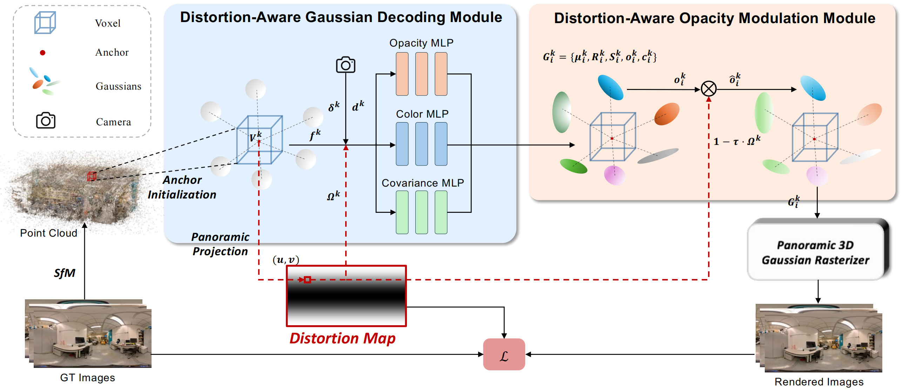

<p align="center">
  <h1 align="center">🌐 PaD-GS: Leveraging Distortion Map for Panoramic Gaussian Splatting</h1>
  <p align="center">
    Yihang Xu &nbsp;·&nbsp; Qiulei Dong
  </p>
  <p align="center">
    <b><i>ECCV 2026</i></b>
  </p>
  <p align="center">
    <a href=""></a>
    <a href="https://github.com/CosyXu/PaD-GS"></a>
  </p>
</p>

<p align="center">
  
</p>

<p align="justify">
We introduce <b>PaD-GS</b>, a novel panoramic Gaussian Splatting method that leverages a distortion map constructed under the panoramic imaging model to reflect each pixel's distortion degree. PaD-GS employs a <b>whole-to-partial strategy</b> to impose the distortion map on Gaussian representation learning: a <b>distortion-aware Gaussian decoding module</b> integrates distortion information at the whole level by decoding scene features together with the distortion map into Gaussian representations, while a <b>distortion-aware opacity modulation module</b> further refines each Gaussian's opacity at the partial level according to its distortion degree. By incorporating distortion information into both whole and partial Gaussian learning, PaD-GS effectively alleviates the negative influence of severe panoramic distortions.
</p>

---

## 📈 Results

### 360Roam (11 indoor scenes)

| Method | SSIM ↑ | PSNR ↑ | LPIPS ↓ |
|:---|:---:|:---:|:---:|
| EgoNeRF | 0.725 | 23.70 | 0.435 |
| OP43DGS | 0.779 | 24.44 | 0.325 |
| ODGS | 0.738 | 23.07 | 0.379 |
| OmniGS | 0.799 | 24.84 | 0.272 |
| SPaGS | 0.788 | 24.90 | 0.288 |
| **PaD-GS (Ours)** | **0.821** | **26.02** | **0.227** |

### Ricoh360 (12 outdoor scenes)

| Method | SSIM ↑ | PSNR ↑ | LPIPS ↓ |
|:---|:---:|:---:|:---:|
| EgoNeRF | 0.766 | 25.28 | 0.292 |
| OP43DGS | -- | -- | -- |
| ODGS | 0.752 | 22.82 | 0.319 |
| OmniGS | 0.825 | 26.00 | 0.212 |
| SPaGS | 0.835 | 26.20 | 0.192 |
| **PaD-GS (Ours)** | **0.845** | **26.54** | **0.184** |

> OP43DGS runs out of memory (OOM) on most Ricoh360 outdoor scenes and is excluded from the average.

---

## 🔧 Installation

Clone the repository and set up a `python=3.11` Anaconda environment with CUDA toolkit 11.8:

```bash
git clone https://github.com/CosyXu/PaD-GS.git
cd PaD-GS

conda create -y -n pad python=3.11
conda activate pad
conda install -y --override-channels -c nvidia/label/cuda-11.8.0 cuda-toolkit
pip install --upgrade pip
pip install -r requirements.txt
pip install ./submodules/scaffold-omnigs-gaussian-rasterization/ --no-build-isolation
pip install ./submodules/simple-knn/ --no-build-isolation
```

---

## 📦 Dataset Preparation

We evaluate PaD-GS on two panoramic datasets:

- **360Roam**: Download from [https://huajianup.github.io/research/360Roam/](https://huajianup.github.io/research/360Roam/)
- **Ricoh360**: Download from [https://github.com/changwoonchoi/EgoNeRF](https://github.com/changwoonchoi/EgoNeRF)

To ensure a fair comparison across different methods, we use the OpenMVG preprocessing scripts from [OmniGS](https://github.com/liquorleaf/OmniGS) to generate consistent camera parameters for all methods.

### Step 1 — Clone OmniGS

```bash
git clone https://github.com/liquorleaf/OmniGS
cd OmniGS/scripts
```

### Step 2 — Preprocess 360Roam

Add your scene names (e.g., `bar`, `base`, `cafe`, ...) to `360roam_scene_list.txt`, then run:

```bash
bash 360roam_to_openmvg_lonlat_pose_known.sh
```

This generates an `openMVG/` folder inside each scene directory. Then convert to the required format:

```bash
python dataset/convert_360roam.py \
    --source_dir /path/to/360Roam/{scene_name} \
    --output_dir /path/to/360Roam_processed/{scene_name}
```

### Step 3 — Preprocess Ricoh360

Add your scene names (e.g., `bricks`, `bridge`, ...) to `egonerf_scene_list_ricoh360.txt`, then run:

```bash
bash egonerf_to_openmvg_lonlat.sh
```

Then convert:

```bash
python dataset/convert_ricoh360.py \
    --source_dir /path/to/Ricoh360/{scene_name} \
    --output_dir /path/to/Ricoh360_processed/{scene_name}
```

> **Note**: Replace `/path/to/` with your own dataset directory.

---

## 🚀 Training

To train PaD-GS on a scene, run:

```bash
bash ./single_train.sh
```

Make sure to set the dataset path and scene name inside `single_train.sh` before running.

---

## 🎬 Rendering

To render novel views after training:

```bash
python render.py -m {path/to/output}
```

---

## 📊 Evaluation

To reproduce the quantitative results reported in the paper:

```bash
python metrics.py -m {path/to/output}
```

---

## 🙏 Acknowledgements

This project builds upon the following excellent works:

- [OmniGS](https://github.com/liquorleaf/OmniGS)
- [3DGS](https://github.com/graphdeco-inria/gaussian-splatting)
- [Scaffold-GS](https://github.com/city-super/Scaffold-GS)

We sincerely thank the authors for their open-source contributions.